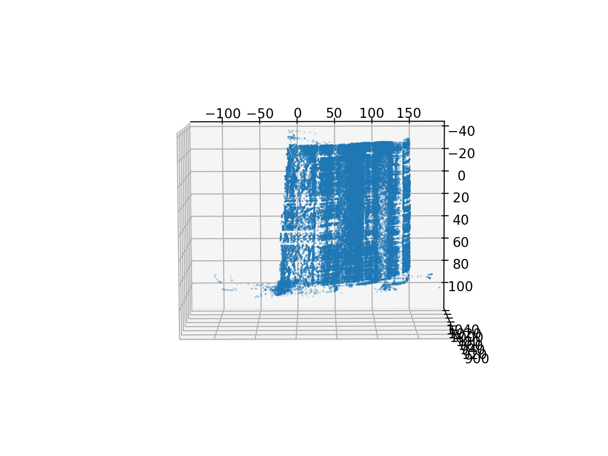

# Structured Light 3D Scanning

A Python script for extraction of a point cloud from a 3D scan using the structured light technique. The coding schemes used are gray coding, phase-shifting and color coding.





## Description

This script was created in the scope of a project for the Computer Vision course at the Technical University of Denmark. It takes as an input a set of images from a stereo camera setup. The cameras were calibrated with a checkerboard pattern. An object was illuminated by a projector with different structured light patterns. The 3D position of points of the object was then calculated from the images through triangulation. We have been able to reduce the number of images by 1 compared to gray coding for the same level of reconstruction by introducing a continous varying color on the higher level of detail.

## Getting Started

### Dependencies

- [Python](https://www.python.org/) 3.9.4 or newer
- [OpenCV-Python](https://pypi.org/project/opencv-python/) 4.5.1.48 or newer
- [NumPy](https://pypi.org/project/numpy/) 1.19.5 or newer
- [Matplotlib](https://matplotlib.org/) 3.3.3 or newer
- [Pandas](https://pandas.pydata.org/) 1.2.0 or newer

### Installing

- Clone or download this repository

### Executing program

- Run the program with the command:
```
python [path-to-repo]/main.py
```

## Further work

- Refactor
- Add console interface

## Authors

- Mateusz Sadowski
[linkedin.com/in/mateuszsadowski1/](https://www.linkedin.com/in/mateuszsadowski1/)
[mateusz.sadowski1@gmail.com](mateusz.sadowski1@gmail.com)

## License

This project is licensed under the MIT License - see the LICENSE.md file for details.

## Acknowledgments

* [README-Template](https://gist.github.com/DomPizzie/7a5ff55ffa9081f2de27c315f5018afc)